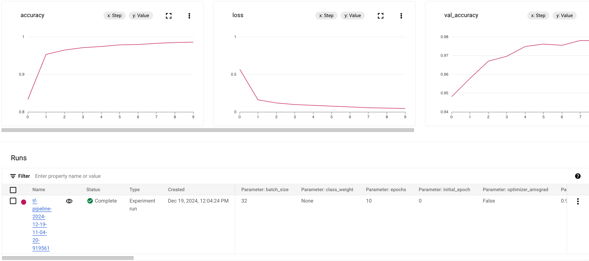
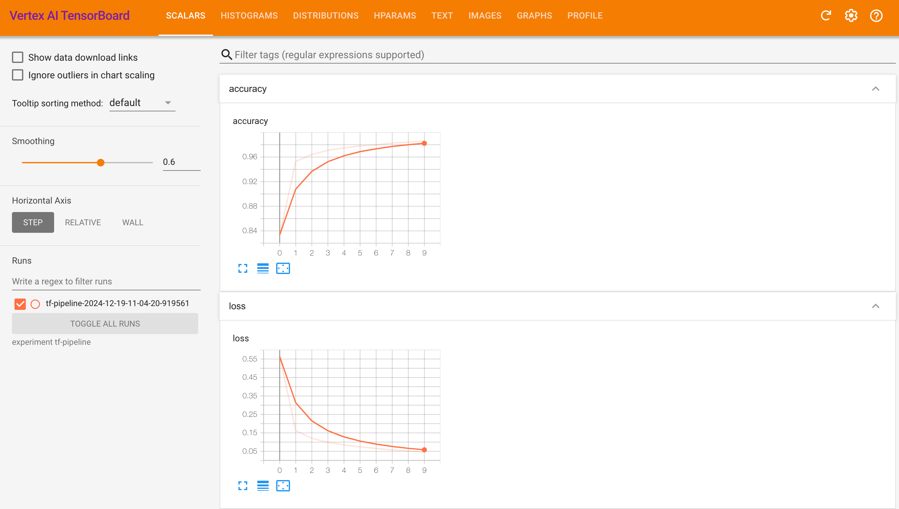

# Google Cloud VertexAI Experiment Tracker

The Vertex AI Experiment Tracker is an [Experiment Tracker](./) flavor provided with the Vertex AI ZenML integration. It uses the [Vertex AI tracking service](https://cloud.google.com/vertex-ai/docs/experiments/intro-vertex-ai-experiments) to log and visualize information from your pipeline steps (e.g., models, parameters, metrics).

## When would you want to use it?

[Vertex AI Experiment Tracker](https://cloud.google.com/vertex-ai/docs/experiments/intro-vertex-ai-experiments) is a managed service by Google Cloud that you would normally use in the iterative ML experimentation phase to track and visualize experiment results. That doesn't mean that it cannot be repurposed to track and visualize the results produced by your automated pipeline runs, as you make the transition toward a more production-oriented workflow.

You should use the Vertex AI Experiment Tracker:

* if you have already been using Vertex AI to track experiment results for your project and would like to continue doing so as you are incorporating MLOps workflows and best practices in your project through ZenML.
* if you are looking for a more visually interactive way of navigating the results produced from your ZenML pipeline runs (e.g. models, metrics, datasets)
* if you are building machine learning workflows in the Google Cloud ecosystem and want a managed experiment tracking solution tightly integrated with other Google Cloud services, Vertex AI is a great choice

You should consider one of the other [Experiment Tracker flavors](./#experiment-tracker-flavors) if you have never worked with Vertex AI before and would rather use another experiment tracking tool that you are more familiar with, or if you are not using GCP or using other cloud providers.

## How do you configure it?

The Vertex AI Experiment Tracker flavor is provided by the GCP ZenML integration, you need to install it on your local machine to be able to register a Vertex AI Experiment Tracker and add it to your stack:

```shell
zenml integration install gcp -y
```

### Configuration Options

To properly register the Vertex AI Experiment Tracker, you can provide several configuration options tailored to your needs. Here are the main configurations you may want to set:

* `project`: Optional. GCP project name. If `None` it will be inferred from the environment.
* `location`: Optional. GCP location where your experiments will be created. If not set defaults to us-central1.
* `staging_bucket`: Optional. The default staging bucket to use to stage artifacts. In the form gs://...
* `service_account_path`: Optional. A path to the service account credential json file to be used to interact with Vertex AI Experiment Tracker. Please check the [Authentication Methods](vertexai.md#authentication-methods) chapter for more details.

With the project, location and staging\_bucket, registering the Vertex AI Experiment Tracker can be done as follows:

```shell
# Register the Vertex AI Experiment Tracker
zenml experiment-tracker register vertex_experiment_tracker \
    --flavor=vertex \
    --project=<GCP_PROJECT_ID> \
    --location=<GCP_LOCATION> \
    --staging_bucket=gs://<GCS_BUCKET-NAME>

# Register and set a stack with the new experiment tracker
zenml stack register custom_stack -e vertex_experiment_tracker ... --set
```

### Authentication Methods

Integrating and using a Vertex AI Experiment Tracker in your pipelines is not possible without employing some form of authentication. If you're looking for a quick way to get started locally, you can use the _Implicit Authentication_ method. However, the recommended way to authenticate to the Google Cloud Platform is through a [GCP Service Connector](https://docs.zenml.io/how-to/infrastructure-deployment/auth-management/gcp-service-connector). This is particularly useful if you are configuring ZenML stacks that combine the Vertex AI Experiment Tracker with other remote stack components also running in GCP.

> **Note**: Regardless of your chosen authentication method, you must grant your account the necessary roles to use Vertex AI Experiment Tracking.
>
> * `roles/aiplatform.user` role on your project, which allows you to create, manage, and track your experiments within Vertex AI.
> * `roles/storage.objectAdmin` role on your GCS bucket, granting the ability to read and write experiment artifacts, such as models and datasets, to the storage bucket.



This configuration method assumes that you have authenticated locally to GCP using the [`gcloud` CLI](https://cloud.google.com/sdk/gcloud) (e.g., by running gcloud auth login).

> **Note**: This method is quick for local setups but is unsuitable for team collaborations or production environments due to its lack of portability.

We can then register the experiment tracker as follows:

```shell
# Register the Vertex AI Experiment Tracker
zenml experiment-tracker register <EXPERIMENT_TRACKER_NAME> \
    --flavor=vertex \
    --project=<GCP_PROJECT_ID> \
    --location=<GCP_LOCATION> \
    --staging_bucket=gs://<GCS_BUCKET-NAME>

# Register and set a stack with the new experiment tracker
zenml stack register custom_stack -e vertex_experiment_tracker ... --set
```



To set up the Vertex AI Experiment Tracker to authenticate to GCP, it is recommended to leverage the many features provided by the [GCP Service Connector](https://docs.zenml.io/how-to/infrastructure-deployment/auth-management/gcp-service-connector) such as auto-configuration, best security practices regarding long-lived credentials and reusing the same credentials across multiple stack components.

If you don't already have a GCP Service Connector configured in your ZenML deployment, you can register one using the interactive CLI command. You have the option to configure a GCP Service Connector that can be used to access more than one type of GCP resource:

```sh
# Register a GCP Service Connector interactively
zenml service-connector register --type gcp -i
```

After having set up or decided on a GCP Service Connector to use, you can register the Vertex AI Experiment Tracker as follows:

```shell
# Register the Vertex AI Experiment Tracker
zenml experiment-tracker register <EXPERIMENT_TRACKER_NAME> \
    --flavor=vertex \
    --project=<GCP_PROJECT_ID> \
    --location=<GCP_LOCATION> \
    --staging_bucket=gs://<GCS_BUCKET-NAME>

zenml experiment-tracker connect <EXPERIMENT_TRACKER_NAME> --connector <CONNECTOR_NAME>

# Register and set a stack with the new experiment tracker
zenml stack register custom_stack -e vertex_experiment_tracker ... --set
```



When you register the Vertex AI Experiment Tracker, you can [generate a GCP Service Account Key](https://cloud.google.com/docs/authentication/application-default-credentials#attached-sa), store it in a [ZenML Secret](https://docs.zenml.io/getting-started/deploying-zenml/secret-management) and then reference it in the Experiment Tracker configuration.

This method has some advantages over the implicit authentication method:

* you don't need to install and configure the GCP CLI on your host
* you don't need to care about enabling your other stack components (orchestrators, step operators and model deployers) to have access to the experiment tracker through GCP Service Accounts and Workload Identity
* you can combine the Vertex AI Experiment Tracker with other stack components that are not running in GCP

For this method, you need to [create a user-managed GCP service account](https://cloud.google.com/iam/docs/service-accounts-create) and then [create a service account key](https://cloud.google.com/iam/docs/keys-create-delete#creating).

With the service account key downloaded to a local file, you can register a ZenML secret and reference it in the Vertex AI Experiment Tracker configuration as follows:

```shell
# Register the Vertex AI Experiment Tracker and reference the ZenML secret
zenml experiment-tracker register <EXPERIMENT_TRACKER_NAME> \
    --flavor=vertex \
    --project=<GCP_PROJECT_ID> \
    --location=<GCP_LOCATION> \
    --staging_bucket=gs://<GCS_BUCKET-NAME> \
    --service_account_path=path/to/service_account_key.json

# Register and set a stack with the new experiment tracker
zenml experiment-tracker connect <EXPERIMENT_TRACKER_NAME> --connector <CONNECTOR_NAME>
```



## How do you use it?

To be able to log information from a ZenML pipeline step using the Vertex AI Experiment Tracker component in the active stack, you need to enable an experiment tracker using the `@step` decorator. Then use Vertex AI's logging or auto-logging capabilities as you would normally do, e.g.

Here are two examples demonstrating how to use the experiment tracker:

### Example 1: Logging Metrics Using Built-in Methods

This example demonstrates how to log time-series metrics using `aiplatform.log_time_series_metrics` from within a Keras callback, and using `aiplatform.log_metrics` to log specific metrics and `aiplatform.log_params` to log experiment parameters. The logged metrics can then be visualized in the UI of Vertex AI Experiment Tracker and integrated TensorBoard instance.

> **Note:** To use the autologging functionality, ensure that the google-cloud-aiplatform library is installed with the Autologging extension. You can do this by running the following command:
>
> ```bash
> pip install google-cloud-aiplatform[autologging]
> ```

```python
from google.cloud import aiplatform

class VertexAICallback(tf.keras.callbacks.Callback):
    def on_epoch_end(self, epoch, logs=None):
        logs = logs or {}
        metrics = {key: value for key, value in logs.items() if isinstance(value, (int, float))}
        aiplatform.log_time_series_metrics(metrics=metrics, step=epoch)


@step(experiment_tracker="<VERTEXAI_TRACKER_STACK_COMPONENT_NAME>")
def train_model(
    config: TrainerConfig,
    x_train: np.ndarray,
    y_train: np.ndarray,
    x_val: np.ndarray,
    y_val: np.ndarray,
):
    aiplatform.autolog()

    ...

    # Train the model, using the custom callback to log metrics into experiment tracker
    model.fit(
        x_train,
        y_train,
        validation_data=(x_test, y_test),
        epochs=config.epochs,
        batch_size=config.batch_size,
        callbacks=[VertexAICallback()]
    )

    ...

    # Log specific metrics and parameters
    aiplatform.log_metrics(...)
    aiplatform.log_params(...)
```

### Example 2: Uploading TensorBoard Logs

This example demonstrates how to use an integrated TensorBoard instance to directly upload training logs. This is particularly useful if you're already using TensorBoard in your projects and want to benefit from its detailed visualizations during training. You can initiate the upload using `aiplatform.start_upload_tb_log` and conclude it with `aiplatform.end_upload_tb_log`. Similar to the first example, you can also log specific metrics and parameters directly.

> **Note:** To use TensorBoard logging functionality, ensure you have the `google-cloud-aiplatform` library installed with the TensorBoard extension. You can install it using the following command:
>
> ```bash
> pip install google-cloud-aiplatform[tensorboard]
> ```

```python
from google.cloud import aiplatform


@step(experiment_tracker="<VERTEXAI_TRACKER_STACK_COMPONENT_NAME>")
def train_model(
    config: TrainerConfig,
    gcs_path: str,
    x_train: np.ndarray,
    y_train: np.ndarray,
    x_val: np.ndarray,
    y_val: np.ndarray,
):
    # get current experiment and run names
    experiment_tracker = Client().active_stack.experiment_tracker
    experiment_name = experiment_tracker.experiment_name
    experiment_run_name = experiment_tracker.run_name

    # define a TensorBoard callback, logs are written to gcs_path
    tensorboard_callback = tf.keras.callbacks.TensorBoard(
        log_dir=gcs_path,
        histogram_freq=1
    )
    # start the TensorBoard log upload
    aiplatform.start_upload_tb_log(
        tensorboard_experiment_name=experiment_name,
        logdir=gcs_path,
        run_name_prefix=f"{experiment_run_name}_",
    )
    model.fit(
        x_train,
        y_train,
        validation_data=(x_test, y_test),
        epochs=config.epochs,
        batch_size=config.batch_size,
    )

    ...

    # end the TensorBoard log upload
    aiplatform.end_upload_tb_log()

    aiplatform.log_metrics(...)
    aiplatform.log_params(...)
```


Instead of hardcoding an experiment tracker name, you can also use the [Client](https://docs.zenml.io/reference/python-client) to dynamically use the experiment tracker of your active stack:

```python
from zenml.client import Client

experiment_tracker = Client().active_stack.experiment_tracker

@step(experiment_tracker=experiment_tracker.name)
def tf_trainer(...):
    ...
```


### Integrating Experiment Trackers with MCP

The ZenML Model Control Plane (MCP) is designed to manage and track machine learning models independently, providing features like version control and metadata tracking. However, integrating experiment trackers can enhance the MCP by providing additional logging and visualization features for experiments and model performance.

#### Benefits of Integration
- **Enhanced Logging and Visualization**: Experiment trackers offer extensive UIs that allow users to browse, visualize, and compare experiment data, complementing the MCP's capabilities.
- **Popular Experiment Trackers**: ZenML supports integration with popular experiment trackers like Comet, MLflow, Neptune, and Weights & Biases.

#### Integration Steps
1. **Configure and Add an Experiment Tracker**: Add an experiment tracker to your ZenML stack.
2. **Enable the Experiment Tracker**: Decorate individual pipeline steps to enable the experiment tracker.
3. **Log Information**: Explicitly log models, metrics, and data to the experiment tracker.
4. **Access the UI**: Use the experiment tracker UI to visualize logged information.

```python
from zenml.client import Client

pipeline_run = Client().get_pipeline_run("<PIPELINE_RUN_NAME>")
step = pipeline_run.steps["<STEP_NAME>"]
experiment_tracker_url = step.run_metadata["experiment_tracker_url"].value
```

### Experiment Tracker UI

You can find the URL of the Vertex AI experiment linked to a specific ZenML run via the metadata of the step in which the experiment tracker was used:

```python
from zenml.client import Client

client = Client()
last_run = client.get_pipeline("<PIPELINE_NAME>").last_run
trainer_step = last_run.steps.get("<STEP_NAME>")
tracking_url = trainer_step.run_metadata["experiment_tracker_url"].value
print(tracking_url)
```

This will be the URL of the corresponding experiment in Vertex AI Experiment Tracker.

Below are examples of the UI for the Vertex AI Experiment Tracker and the integrated TensorBoard instance.

**Vertex AI Experiment Tracker UI**

**TensorBoard UI**

### Additional configuration

For additional configuration of the Vertex AI Experiment Tracker, you can pass `VertexExperimentTrackerSettings` to specify an experiment name or choose previously created TensorBoard instance.

> **Note**: By default, Vertex AI will use the default TensorBoard instance in your project if you don't explicitly specify one.

```python
import mlflow
from zenml.integrations.gcp.flavors.vertex_experiment_tracker_flavor import VertexExperimentTrackerSettings


vertexai_settings = VertexExperimentTrackerSettings(
    experiment="<YOUR_EXPERIMENT_NAME>",
    experiment_tensorboard="TENSORBOARD_RESOURCE_NAME"
)

@step(
    experiment_tracker="<VERTEXAI_TRACKER_STACK_COMPONENT_NAME>",
    settings={"experiment_tracker": vertexai_settings},
)
def step_one(
    data: np.ndarray,
) -> np.ndarray:
    ...
```

Check out [this docs page](https://docs.zenml.io/how-to/pipeline-development/use-configuration-files/runtime-configuration) for more information on how to specify settings.

<figure><figcaption></figcaption></figure>
